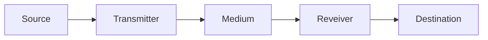

# Table of Contents

- [[#1. What is Data Communication?|1. What is Data Communication?]]
- [[#2. The Simplified Data Communication Model|2. The Simplified Data Communication Model]]
- [[#3. Key Characteristics of Data Communication|3. Key Characteristics of Data Communication]]
- [[#4. Data vs Signal|4. Data vs Signal]]
- [[#5. Signal Electromagnetism|5. Signal Electromagnetism]]
- [[#6. Analog vs Digital Signals|6. Analog vs Digital Signals]]
- [[#7. Sine Waves|7. Sine Waves]]
- [[#8. Sine Waves in AC|8. Sine Waves in AC]]

---
# 1. What is Data Communication?

Data Communication is the exchange of data between two or more devices. We exchange data to share information with others.

# 2. The Simplified Data Communication Model



- **Source**: The data to be transmitted
- **Transmitter**: Transforms data into signals
- **Medium**: Carries signals, connecting source and destination
- **Receiver**: Converts signal into data
- **Destination**: Takes incoming data

# 3. Key Characteristics of Data Communication

1. **Delivery**
	-  Data should be delivered to the **correct destination** and **correct user**.
2. **Accuracy**
	- Data should be delivered **accurately**, without no (or *minimal*) errors.
3. **Timeliness**
	- Data should be delivered in a **timely manner**, with no (or **minimal**) delays.
4. **Jitter**
	- **Variation of packet arrival time**. Uneven jitter may affects the timeliness of data transmission.

# 4. Data vs Signal

Data is some entity that conveys information. For examples, digital bits that represent a string of characters, or voltage level that indicate temperature readings. 

Signal is the **electromagnetic** representation of data, used to transmitted (or carry) data from the source to the destination. 

Signals **encode** a message into a form the transmitter can use. For example, a string of bits may be encoded into an electrical signal with varying voltages, which is generated by the transmitter and sent through copper wire.

# 5. Signal Electromagnetism

Signals are electromagnetic radiation spreading through different media (e.g. copper wire, free air) to transmit data. Electromagnetic radiations are waves with different amplitudes and frequencies.

> [!info]
> In telephone systems, frequency band ranges from **300Hz - 3400Hz**

# 6. Analog vs Digital Signals

Analog (continuous) signals varies **smoothly** over time. 

Digital (discrete) signals maintains a **constant** level over a period of time, and then change to a different level.

![[analog_vs_digital_signals.jpg | center]]

# 7. Sine Waves

Sine waves are the most basic form of a **periodic** analog signal.

```desmos-graph
top=2; bottom=-2;
left=-7; right=7;
---
y=\sin(x)
```

All sine waves have the form:
$$
s(t) = A\sin(2\pi f t + \phi)
$$
Where:
- $A$ is the **amplitude**, the maximum strength of the signal
- $f$ is the **frequency**
	- Rate of change of signal. Measured in **Hz** (how many cycles per second)
	- Inverse of period $T$. That is, $T = 1/f$. Measured in seconds (how many seconds per cycle)
- $\phi$ is the **phase**, offset of initial position, measured in **radians** 

# 8. Sine Waves in AC

In an AC current, the voltage and/or current can be modeled using sine waves. For example, an AC current with the voltage:
$$
v(t) = 325\sin(2\pi .50.t)
$$
Means that the maximum voltage is 325 Volts, with a frequency of 50 Hz. The period is therefore:
$$
T = 1/f = 1/50 = 0.02s =20ms
$$
To calculate the **effective value** of a sine wave, we use the **Root Mean Square (RMS)**:
$$
V_{effective} = \frac{V_{max}}{\sqrt2} 
$$
>[!info]
>The effective value is the **DC voltage** for which this current will produce the same **average power**. See more [here](https://www.khanacademy.org/science/in-in-class-12th-physics-india/x51bd77206da864f3:alternating-current/x51bd77206da864f3:rms-values-of-current-voltage/v/what-is-rms-value-why-should-we-care)

---
See next: 
- [[Network Basics]]
- [[Data, Signals and Transmission]]
- [[OSI Reference Model]]
